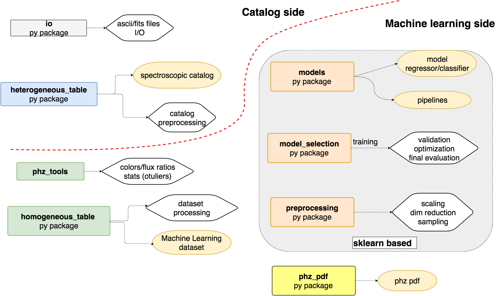
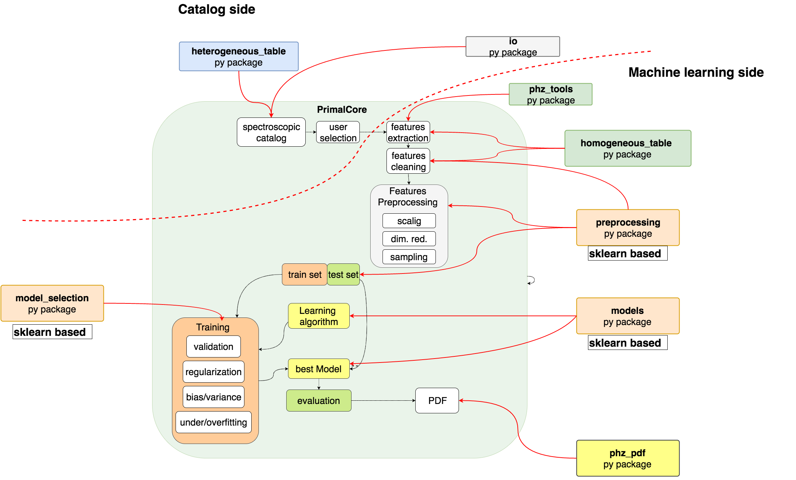

Primal Core Package
===================
.. contents:: :local:

.. toctree::

Introduction
-------------
.. currentmodule:: PrimalCore

PrimalCore python  package  implements:
    - catalogs and ML datasets
    - ML models based on regressors and classifiers
    - Validation and Model optimization
    - PDF for PhZ

Tree structure
--------------
.. code::

   PrimalCore
   ├── heterogeneous_table
   │   ├── io.py
   │   ├── table.py
   │   ├── table_handler.py
   │   └── tools.py
   ├── homogeneous_table
   │   ├── dataset.py
   │   ├── dataset_handler.py
   │   └── tools.py
   ├── io
   │   └── fits.py
   ├── model_selection
   │   ├── cross_validation.py
   │   ├── grid_search_optimize.py
   │   ├── model_validation.py
   │   └── splitter.py
   ├── models
   │   ├── base.py
   │   ├── classification.py
   │   ├── pipeline.py
   │   └── regression.py
   ├── pdf
   │   └── stats.py
   ├── phz_tools
   │   ├── photometry.py
   │   └── stats.py
   └── preprocessing
       ├── dataset_preprocessing.py
       └── features_selection.py

Overview
--------------
The scheme below shows the different subpackages (rounded boxes) and  the implemented
objects (ellipse) and functionalities (parallelogram). The thin black dashed lines arrows show in which subpackage
an object or a functionality is implemented.

    schematic view of the PrimalCore package organization

    schematic view of the PrimalCore package organization

Coding documentation
--------------------
.. toctree::
   :maxdepth: 1

   heterogeneous table <heterogeneous_table/doc_module.rst>
   homogeneous table <homogeneous_table/doc_module.rst>
   models <models/doc_module.rst>
   io  <io/doc_module.rst>
   model selection <model_selection/doc_module.rst>
   preprocessing <preprocessing/doc_module.rst>
   pdf <pdf/doc_module.rst>

Quick Start
-------------
.. toctree::
   :maxdepth: 2

   primal core tutorial: <quick_start/primal_core_tutorial.rst>

User guides
-------------
.. toctree::
   :maxdepth: 2

   heterogeneous_table: Tables <heterogeneous_table/table_user_guide.rst>
   homogeneous: MLDataSet <homogeneous_table/mldataset_userguide.rst>

Full API Doc
------------
.. toctree::
   :maxdepth: 2

   Primal Core <API_full.rst>

Indices and tables
------------------
* :ref:`genindex`
* :ref:`modindex`
* :ref:`search`