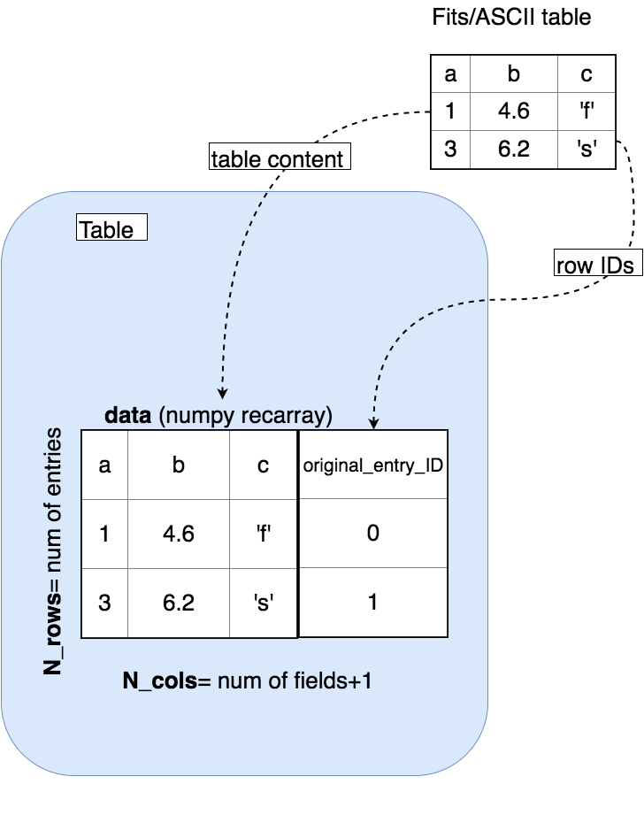

Table
=====
.. contents:: :local:

.. toctree::

API documentation
-------------------
.. currentmodule:: PrimalCore.heterogeneous_table.table

The class :class:`Table` (see for full API the module :mod:`PrimalCore.heterogeneous_table.table`)

implements some functionalities to handle heterogeneous tables. The main implemented features are:
    - factories to build objects from ASCII/FITS files
    - easy and safe methods to add/remove colums
    - regular expression to select list of columns names to keep or drop
    - storage of the original entry ID, that allows to map each row( after row-wise manipulation) to the original entry in the input data

    schematic view of the Table class memory organization

.. rubric:: Table Class

.. autosummary:: Table

.. autoclass:: Table

.. rubric:: Table attributes

.. autosummary::
    ~Table.data
    ~Table.original_entry_ID
    ~Table.column_names
    ~Table.N_cols
    ~Table.N_rows

.. rubric:: Table methods

.. autosummary::
   ~Table.from_fits_file
   ~Table.keep_columns
   ~Table.drop_columns
   ~Table.add_columns
   ~Table.add_rows
   ~Table.drop_rows
   ~Table.keep_rows

User guide
----------
.. toctree::
   :maxdepth: 3

   Building catalog using Tables <table_user_guide.rst>

