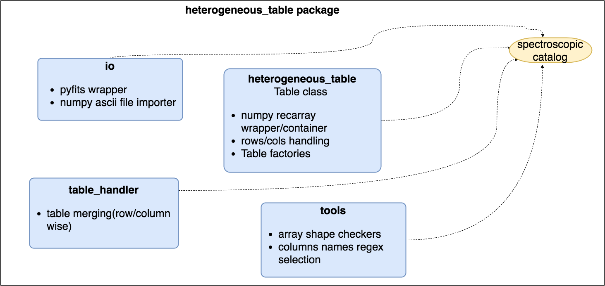

heterogeneous_table
===================
.. contents:: :local:

.. toctree::

.. currentmodule:: PrimalCore.heterogeneous_table

Introduction
------------
The :mod:`PrimalCore.heterogeneous_table` subpackage  is designed to provide tools to handle tables whit columns storing
data of heterogeneous type:
- The class :class:`table.Table` can be used to implements catalogs
- The class :class:`table.Table` provides methods to perform operations on rows and columns
- Catalogs can be combined (row-wise/column-wise) together using functions in the :mod:`PrimalCore.heterogeneous_table.table_handler` python module

    schematic view of the heterogeneous_table organization

Modules relationship and UML diagrams
-------------------------------------
.. figure::  ../pyreverse/packages_heterogeneous_table.png
    :align: center
    :figclass: align-center

    schematic view of the heterogeneous_table modules relationship

    UML diagrams of classes

Code documentation
------------------
.. toctree::
   :maxdepth: 1

   heterogeneous table <API_table.rst>
   table  handler <API_table_handler.rst>

User guide
----------
.. toctree::
   :maxdepth: 3

   Building catalog using Tables <table_user_guide.rst>

Full API
--------
:mod:`PrimalCore.heterogeneous_table`
