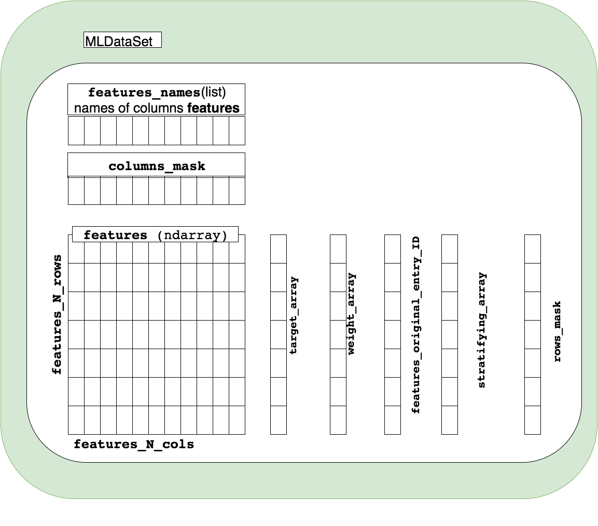

Homogeneous table
===================
.. contents:: :local:

.. toctree::

API documentation
-------------------
.. currentmodule:: PrimalCore.homogeneous_table.dataset

    schematic view of the features 2dim array and the corresponding  1dim array storing target, weights and original entry ID

The class :class:`MLDataSet` (see for full API the module :mod:`PrimalCore.homogeneous_table.dataset`)

implements a dataset designed for Machine Learning. The main implemented features are:
    * storage of features in a 2dim numpy array (:attr:`MLDataSet.features`)
    * optional storage of target in a 1dim numpy array (:attr:`MLDataSet.target_array`)
    * optional storage of weights in a 1dim numpy array (:attr:`MLDataSet.weight_array`)
    * optional storage of original entry ID (:attr:`MLDataSet.features_original_entry_ID`)
    * a boolean columns mask that allows to mask columns after features selection in a flexible way
    * a boolean rows mask that allows to mask columns after features selection in a flexible way
    * if the target is not a label, or it is a continuous variable, the stratified sampling
      might fail. The class allows to perform a binning on the target array. Each entry will have label
      (**used only for the stratification**) given by the bin ID (:attr:`MLDataSet.stratifying_array`).

.. rubric:: MLDataSet Class

.. autosummary:: MLDataSet

.. autoclass:: MLDataSet

.. rubric:: MLDataSet attributes

.. autosummary::
    ~MLDataSet.features
    ~MLDataSet.features_names
    ~MLDataSet.target_array
    ~MLDataSet.stratifying_array
    ~MLDataSet.weight_array
    ~MLDataSet.features_original_entry_ID
    ~MLDataSet.features_N_rows
    ~MLDataSet.features_N_cols
    ~MLDataSet.columns_mask

.. rubric:: MLDataSet methods

.. autosummary::
   ~MLDataSet.new_from_table
   ~MLDataSet.new_from_fits_file
   ~MLDataSet.get_feature_by_name
   ~MLDataSet.rename_feature

User guide
-----------
:ref:`MLDataSet_user_guide`