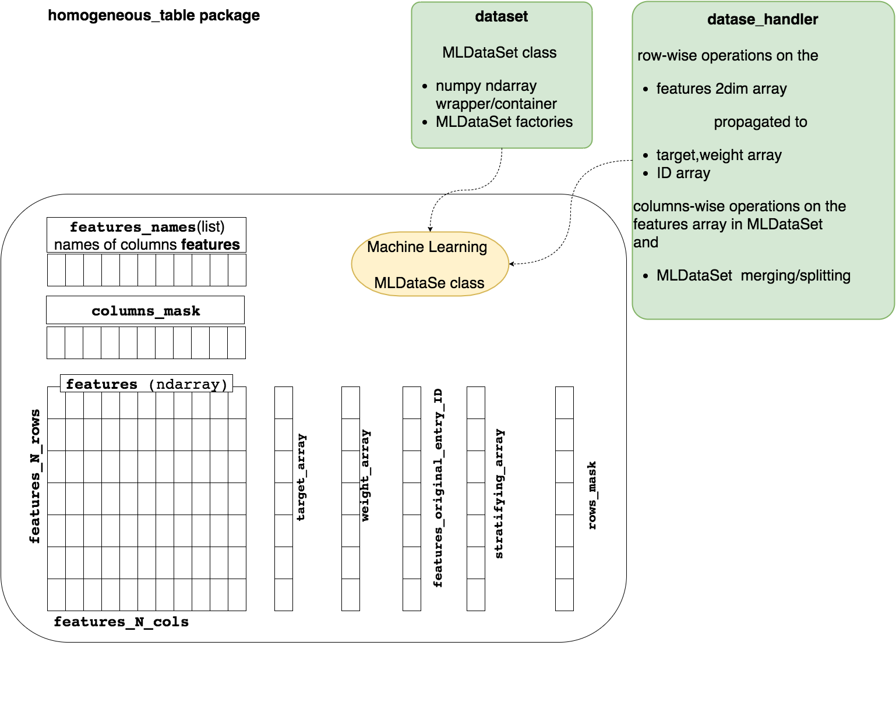
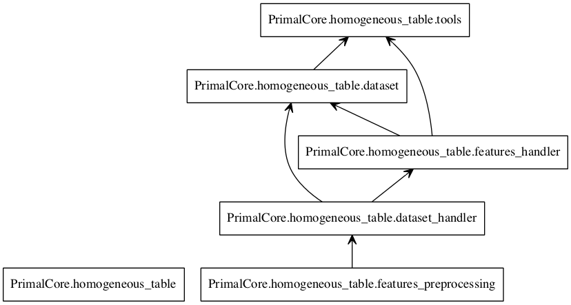
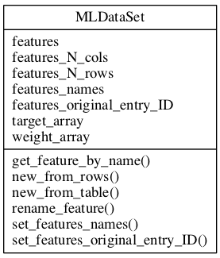

Homogeneous Table
==================
.. contents:: :local:

.. toctree::

.. currentmodule:: PrimalCore.homogeneous_table

Introduction
------------
The :mod:`PrimalCore.homogeneous_table` subpackage  is designed to provide tools to handle dataset  of features to be used in Machine Learning.

The dataset are implemented using the :class:`dataset.MLDataSet`
    * The :class:`dataset.MLDataSet` stores the features into 2-dim numpy array with a shape [features_N_rows,features_N_cols], whit  features_N_cols equal to the number of the features, and features_N_rows equal to the number of the entries
    * The same class has separate members to store (These are 1-dim numpy array, with a size equal to features_N_rows):
        * the target (target_array)
        * the weights  (weight_array)
        * the original entry ID (features_original_entry_ID)
    * The class handles in a safe way the proper matching of entries among features, targets, and weights
    * a boolean columns mask that allows to mask columns after features selection in a flexible way
    * a boolean rows mask that allows to mask columns after features selection in a flexible way
    * capability to perform stratified sampling if the target is not a label, or it is a continuous variable.

It is possible to modify the a dataset is several ways:
    * Features can be added or dropped, or resorted(columns-wise) using the functions in the :mod:`features_handler` python module
    * Row-wise operations to the features can be done using the functions in the module :mod:`dataset_handler`,  and :mod:`features_preprocessing` python modules. These operations are safely propagated to the targets and weights array

    schematic view of the  homogeneous_table organization

Modules relationship and UML diagrams
-------------------------------------

    schematic view of the homogeneous_table modules relationship

    UML diagrams of classes

Coding documentation
--------------------
.. toctree::
   :maxdepth: 0

   dataset <API_dataset.rst>
   dataset_handler <API_dataset_handler.rst>

User guides
-----------
.. toctree::
   :maxdepth: 1

   MLDataSet <mldataset_userguide.rst>

Full API
--------
:mod:`PrimalCore.homogeneous_table`