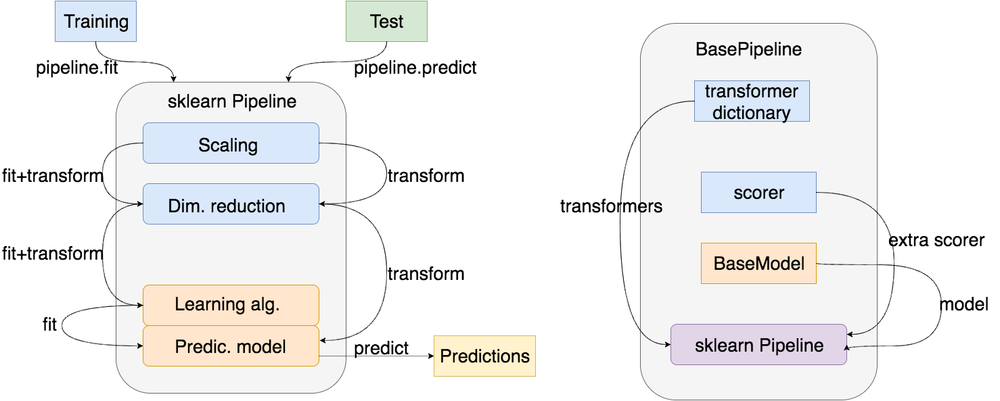

pipelines
=========
.. contents:: :local:

.. toctree::

API documentation
-------------------
.. currentmodule:: PrimalCore.models.pipeline
.. _sklearn: http://scikit-learn.org/stable/documentation.html

In this python module  the class :class:`BasePipeline` is implemented (see for full API the module :mod:`~PrimalCore.models.pipelines`).
This class implements a base model to wrap  :class:`sklearn.pipeline.Pipeline`. The class offers the possibility:
    * To plug any :class:`PrimalCore.models.base.BaseModel` derived model
    * To define a dictionary of transformers to implement any transformation sequence
    * To add a user defined scorer

    Left plot credits [Ref]_.

.. rubric:: BasePipeline Class

.. autosummary:: BasePipeline

.. rubric:: BasePipeline methods

.. autosummary::
   ~BasePipeline.step_names

.. rubric:: Factories

.. autosummary::
    pipeline_stratified_kfold_cv

.. raw:: latex

 \bibliographystyle{plain}
 \bibliography{listb.bib}

.. [Ref] Python Machine Learning, Author Raschka Sebastian, Year 2015, Editor Packt Publishing, ISBN 1783555130
