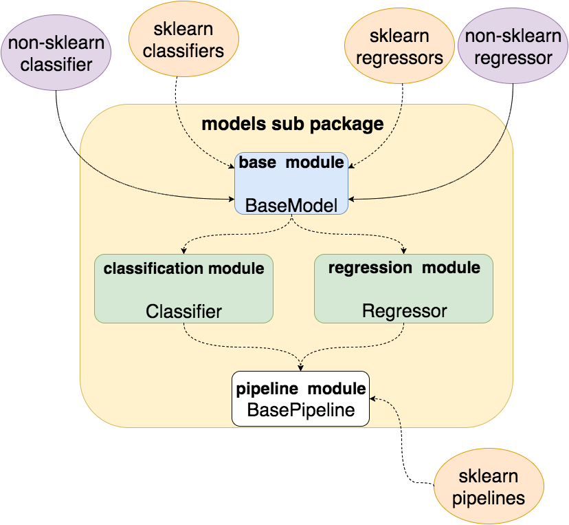
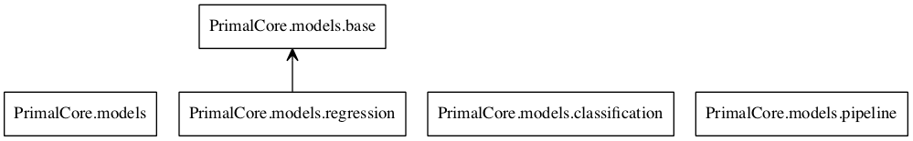
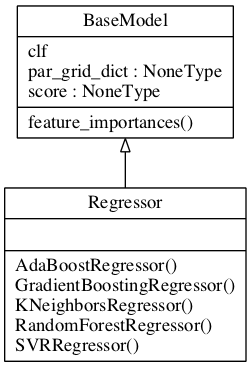

models
==================
.. contents:: :local:

.. toctree::

.. currentmodule:: PrimalCore.models

Introduction
------------
.. _sklearn: http://scikit-learn.org/stable/documentation.html

The :mod:`PrimalCore.models` implements models for Machine Learning based on `sklearn`_

The ML models are handled by the following classes:
    * :class:`base.BaseModel`  is a base class that wraps sklearn models for  supervised learning,
      or to wrap non-sklearn making them compatible with the sklearn framework
      It offers some convenient function to handle the model parameters, and the feature importances.
    * :class:`classification.Classifier` is a derived  class that wraps sklearn Classifiers
    * :class:`regression.Regressor`  is a derived  class that wraps sklearn Regressors
    * :class:`~PrimalCore.models.pipeline.BasePipeline` implements  pipelines based on  the :class:`sklearn.pipeline.Pipeline`,
    class. These pipelines provides useful interfaces to perform series of transformations + final model traning/predictions
    eg:
        * scaling+stratified cv+Random Forest regression

    schematic view of the  models organization

Modules relationship and UML diagrams
-------------------------------------

    schematic view of the models modules relationship

    UML diagrams of classes

Coding documentation
--------------------
.. toctree::
   :maxdepth: 0

   base <API_base.rst>
   classification <API_classification.rst>
   regression <API_regression.rst>
   pipeline <API_pipeline.rst>

User guides
-----------

Full API
--------
:mod:`PrimalCore.models`