PrimalCore quick start
======================

.. _PrimalCore_quick_start:

.. currentmodule:: PrimalCore

.. contents:: :local:

.. toctree::

Building a Catalog
------------------
Download the catalog:

* wget http://isdc.unige.ch/~tramacer/stuff/euclid_cosmos_DC2_S2_v2.1_calib.fits.gz

We now follow the approach in :ref:`Table_user_guide`  to build a catalog using the :class:`PrimalCore.heterogeneous_table.table.Table` class. This class is able to handle heterogeneous data, by using numpy recarray and implements also method to handle the data row-wise and column wise (see :class:`PrimalCore.heterogeneous_table.table.Table` and :mod:`_PrimalCore.heterogeneous_table.table` for more details)

.. code:: python

    from PrimalCore.heterogeneous_table.table import Table

.. code:: python

    ph_catalog='./euclid_cosmos_DC2_S2_v2.1_calib.fits.gz'

.. code:: python

    catalog=Table.from_fits_file(ph_catalog,fits_ext=1)

.. parsed-literal::

    | input data built
    | data Rows,Cols 198435 124

the catalog has been built.

Catalog preprocessing
~~~~~~~~~~~~~~~~~~~~~

Since we have a large number of columns (124) and we are not interested
in all of them, we can keep only the needed ones.

We use the ``keep_columns`` method:

.. code:: python

    catalog.keep_columns(['FLUX*2','FLUX_VIS','reliable_S15','STAR','AGN','MASKED','FLAG_PHOT','z_spec_S15'],regex=True)

As a further step of the catalog preprocessing we make a cut to select
clean entries:
``CLEAN=" (FLAG_PHOT == 0) & (MASKED == 0) & (STAR == 0) & (AGN == 0)& (reliable_S15==1)"``

.. code:: python

    CLEAN= (catalog.data['FLAG_PHOT']==0)*(catalog.data['MASKED']==0)*(catalog.data['STAR']==0)
    CLEAN*=(catalog.data['AGN']==0)*(catalog.data['reliable_S15']==1)
    catalog.keep_rows(CLEAN)

.. parsed-literal::

    | filtering data rows
    | data initial Rows,Cols= (198435,)
    | data filtered Rows,Cols= (13252,)
    

The number of rows has decreased.

Building a ML DataSet
---------------------

The ``Table`` class stores the data in numpy recarray, but machine learning algorithms usually request homogeneous arrays. For this purpose we can use the :class:`PrimalCore.homogeneous_table.dataset.MLDataSet` class
This class implements several functionalities that facilitate the use for ML 
We follow the approach in :ref:`MLDataSet_user_guide`

.. code:: python

    from PrimalCore.homogeneous_table.dataset import MLDataSet
    from PrimalCore.homogeneous_table.dataset_handler import drop_features
    from PrimalCore.homogeneous_table.dataset_handler import keep_features
    from PrimalCore.homogeneous_table.dataset_handler import add_features

.. code:: python

    dataset=MLDataSet.new_from_table(catalog,target_col_name='z_spec_S15',target_bins=20,target_binning='log',catalog_file=ph_catalog)

.. parsed-literal::

    | building features
    | features built
    | Rows,Cols 13252 20

since our target variableit is a contineous variable, the stratified
sampling might fail. Setting target\_bins, a binning is performed with a
number of bins equal to target\_bins. Each entry will have a label given
by the bin ID. the target\_binning parameter sets the binning strategy
to logarithmic

DataSet preprocessing
---------------------

Features preprocessing: adding flux ratios
~~~~~~~~~~~~~~~~~~~~~~~~~~~~~~~~~~~~~~~~~~

We can add a new features with the :py:func:`PrimalCore.homogeneous_table.dataset_handler.add_features` function, and the :class:`PrimalCore.phz_tools.pohotmetry.FluxRatio` class

.. code:: python

    from PrimalCore.phz_tools.photometry import FluxRatio

.. code:: python

    flux_bands_list_2=['FLUX_G_2','FLUX_R_2','FLUX_I_2','FLUX_Z_2','FLUX_Y_2','FLUX_J_2','FLUX_VIS','FLUX_VIS','FLUX_VIS']
    flux_bands_list_1=['FLUX_R_2','FLUX_I_2','FLUX_Z_2','FLUX_Y_2','FLUX_J_2','FLUX_H_2','FLUX_Y_2','FLUX_J_2','FLUX_H_2']

.. code:: python

    for f1,f2 in zip(flux_bands_list_1,flux_bands_list_2):
        f1_name=f1.split('_')[1]
        f2_name=f2.split('_')[1]
        if f1 in dataset.features_names and f2 in dataset.features_names:
            f=FluxRatio('F_RATIO_%s'%(f2_name+'-'+f1_name),f1,f2,features=dataset)
            add_features(dataset,f.name,f.values)

Features preprocessing: selecting features and adding weights
~~~~~~~~~~~~~~~~~~~~~~~~~~~~~~~~~~~~~~~~~~~~~~~~~~~~~~~~~~~~~

We can decide to keep only columns with **Flux** and **FluxRatio**
information.

To do this we can use the :func:`PrimalCore.homogeneous_table.dataset_handler.keep_features` function and the regular expressions 'FLUX_*' and 'F_RATIO*'

.. code:: python

    keep_features(dataset,['FLUX*','F_RATIO*'],regex=True)

.. parsed-literal::

    | features initial Rows,Cols= 13252 29
    | removing features ['FLAG_PHOT', 'MASKED', 'reliable_S15', 'STAR', 'AGN']
    | features final Rows,Cols= 13252 24
    

.. code:: python

    dataset.features_names

.. parsed-literal::

    ['FLUX_G_2',
     'FLUX_R_2',
     'FLUX_I_2',
     'FLUX_VIS',
     'FLUX_Z_2',
     'FLUX_Y_2',
     'FLUX_J_2',
     'FLUX_H_2',
     'FLUXERR_G_2',
     'FLUXERR_R_2',
     'FLUXERR_I_2',
     'FLUXERR_Z_2',
     'FLUXERR_Y_2',
     'FLUXERR_J_2',
     'FLUXERR_H_2',
     'F_RATIO_G-R',
     'F_RATIO_R-I',
     'F_RATIO_I-Z',
     'F_RATIO_Z-Y',
     'F_RATIO_Y-J',
     'F_RATIO_J-H',
     'F_RATIO_VIS-Y',
     'F_RATIO_VIS-J',
     'F_RATIO_VIS-H']

.. code:: python

    from PrimalCore.heterogeneous_table.tools import build_names_list
    
    flux_name_list=build_names_list('FLUX_*_2',dataset.features_names,regex=True)
    flux_err_name_list=build_names_list('FLUXERR_*_2',dataset.features_names,regex=True)
    
    
    
    dataset.weight_array=1.0/dataset.get_feature_by_name('FLUXERR_J_2')

.. code:: python

    dataset.weight_array

.. parsed-literal::

    array([ 4.49985677,  3.67068885,  2.62369698, ...,  3.99935633,
            3.16386988,  3.26524177])

Model Training
--------------

Train/Test splitting
~~~~~~~~~~~~~~~~~~~~

We split the dataset into train and test, using a shuffling with
stratified sampling.

To perform the stratified splitting we use the :func:`PrimalCore.model_selection.splitter.dataset_train_test_split`  function. Remind that when we built the dataset object  with set the binning of the target with 20 bins, and using logarithmic binning strategy.

.. code:: python

    from PrimalCore.preprocessing.dataset_preprocessing import dataset_train_test_split

.. code:: python

    train,test=dataset_train_test_split(dataset,train_ratio=0.2,stratify=True)
    print train.features_N_rows, test.features_N_rows

.. parsed-literal::

    2650 10602

The plot below shows that the redsfhit distributions for the full, the
training, and the test set are similar thanks to the stratification.

.. code:: python

    import matplotlib.pylab as plt
    %matplotlib inline
    plt.rcParams['figure.figsize']=8,8
    
    plt.hist(dataset.target_array,bins=20,histtype='step',normed=True,label='full')
    plt.hist(train.target_array,bins=20,histtype='step',normed=True,label='train')
    plt.hist(test.target_array,bins=20,histtype='step',normed=True,label='test')
    plt.xlabel('z')
    plt.legend()
    plt.show()

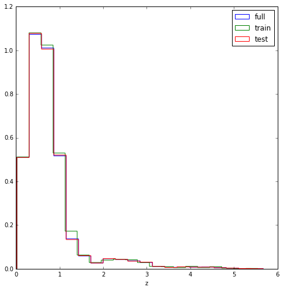

Running an AdaBost regression
~~~~~~~~~~~~~~~~~~~~~~~~~~~~~

We use the :class:``PrimalCore.models.regression.Regressor``, and the
class method ``AdaBoostRegressor``

.. code:: python

    from PrimalCore.models.regression import Regressor

.. code:: python

    ada_boost_model=Regressor.ABRegressor(n_estimators=50)

To train our model we call the fit method

.. code:: python

    ada_boost_model.clf.fit(train.features,train.target_array)

.. parsed-literal::

    AdaBoostRegressor(base_estimator=DecisionTreeRegressor(criterion='mse', max_depth=None, max_features=None,
               max_leaf_nodes=None, min_impurity_split=1e-07,
               min_samples_leaf=1, min_samples_split=2,
               min_weight_fraction_leaf=0.0, presort=False, random_state=None,
               splitter='best'),
             learning_rate=1.0, loss='linear', n_estimators=50,
             random_state=None)

We can plot the results using the :func:`PrimalInteractive.plotting.phz_plots.plot_z_spec_vs_z_phot`

.. code:: python

    from PrimalInteractive.plotting.phz_plots import plot_z_spec_vs_z_phot
    
    plt.rcParams['figure.figsize']=10,10
    
    z_spec=test.target_array
    z_phot=ada_boost_model.clf.predict(test.features)
    
    prima_plot=plot_z_spec_vs_z_phot(z_spec,z_phot,plot=True)

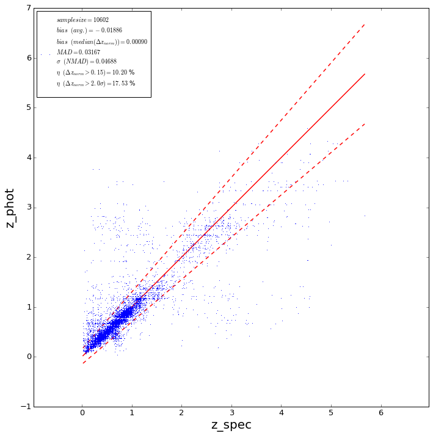

.. code:: python

    from PrimalInteractive.plotting.phz_plots import plot_z_spec_vs_z_phot_kde
    
    prima_plot=plot_z_spec_vs_z_phot_kde(z_spec,z_phot,plot=False,gridsize=50,n_levels=20)
    prima_plot.ax.set_ylim(-0.1,1.5)
    prima_plot.ax.set_xlim(-0.1,1.5)
    plt.show()

.. parsed-literal::

    /Users/orion/anaconda/lib/python2.7/site-packages/IPython/html.py:14: ShimWarning: The `IPython.html` package has been deprecated. You should import from `notebook` instead. `IPython.html.widgets` has moved to `ipywidgets`.
      "`IPython.html.widgets` has moved to `ipywidgets`.", ShimWarning)

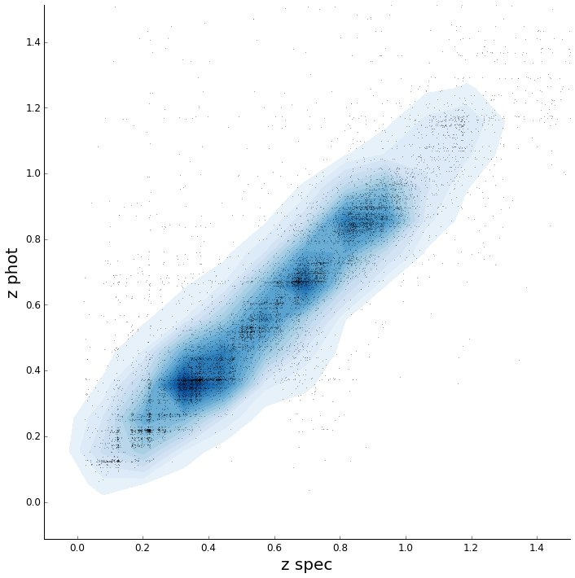

We can plot the feature importances using the :func:`PrimalInteractive.plotting.phz_plots.plot_features_imp` function
and we can get the feature importances using the  :meth:`PrimalCore.models.regression.feature_importances` method

.. code:: python

    from PrimalInteractive.plotting.phz_plots import plot_features_imp
    plt.rcParams['figure.figsize']=8,8
    
    feat_imp=ada_boost_model.feature_importances(feature_names=train.features_names)
    prima_plot=plot_features_imp(feat_imp['score'],feature_names=feat_imp['name'],plot=True)

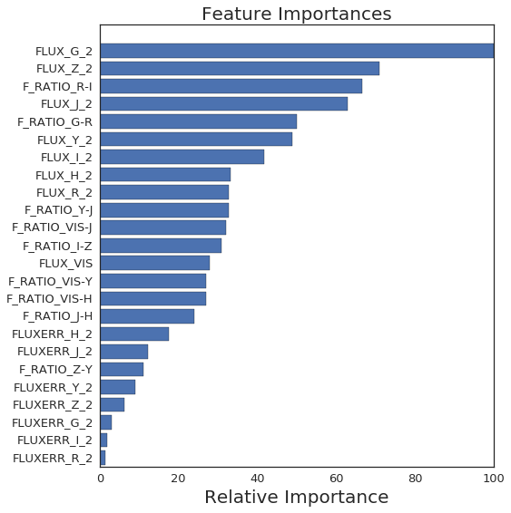

Model Recursive features elimination
------------------------------------

To understand if we need all the features, we can perform a recursive
feature elimination.

We use the :func:`PrimalCore.preprocessing.features_selection.rec_feat_rem_cv`. We can pass to rec_feat_rem_cv a specific score function, in this case we pass the :func:`PrimalCore.phz_tools.stats.outliers_score`, so that feature removal will be optimized according to the outliers fraction (the lower the better, actually outliers_score returns the percentage of non outliers)

.. code:: python

    from PrimalCore.preprocessing.features_selection import rec_feat_rem_cv
    from PrimalCore.phz_tools.stats import outliers_score
    initial_feat_num=train.features_N_cols
    support,n_features,scores,ranking=rec_feat_rem_cv(ada_boost_model,train,cv=5,scoring=outliers_score,filter=True)

.. parsed-literal::

    Optimal number of features : 22

.. code:: python

    plt.plot(np.arange(initial_feat_num)+1,100.0-scores)
    plt.xlabel('n features')
    plt.ylabel('outlier %')
    plt.show()

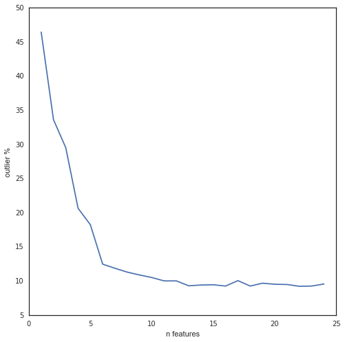

The highest score, i.e. the lowest fractio of outliers is obtained for
17 features We can now rerun the training with the reduced fetures set.
By passing the filter=True parameter, the features are automatically
removed from the train dataset.

.. code:: python

    plt.rcParams['figure.figsize']=8,8
    
    feat_imp=ada_boost_model.feature_importances(feature_names=train.features_names)
    ax=plot_features_imp(feat_imp['score'],feature_names=feat_imp['name'],plot=True)

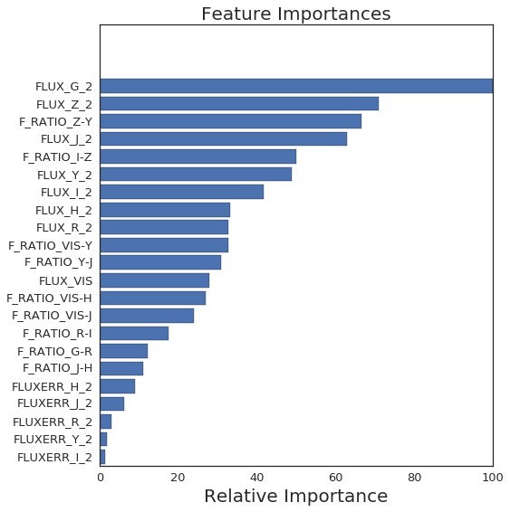

We train again our model with the reduced number of features

.. code:: python

    ada_boost_model.clf.fit(train.features,train.target_array)

.. parsed-literal::

    AdaBoostRegressor(base_estimator=DecisionTreeRegressor(criterion='mse', max_depth=None, max_features=None,
               max_leaf_nodes=None, min_impurity_split=1e-07,
               min_samples_leaf=1, min_samples_split=2,
               min_weight_fraction_leaf=0.0, presort=False, random_state=None,
               splitter='best'),
             learning_rate=1.0, loss='linear', n_estimators=50,
             random_state=None)

.. note::
    
    We can plot the new results. Remind that now the model is trained with a **lower** number of fetures, but the test set has still the **old** number of features. With the instruction ``test.features[:,support]`` we select only the features selected by the rec_feat_rem_cv function. **This can be skipped passing the paramter** ``test_set=test`` to ``rec_feat_rem_cv``, or we can use the :func:`PrimalCore.homogeneous_table.dataset_handler.keep_features`.
The latter choice will premanently change the fetuares array shape. A further possbility is to set the `columns_mask` attribute

.. code:: python

    test.columns_mask=support
    print test.columns_mask
    print train.columns_mask

.. parsed-literal::

    [ True  True  True  True  True  True  True  True False  True  True False
      True  True  True  True  True  True  True  True  True  True  True  True]
    [ True  True  True  True  True  True  True  True False  True  True False
      True  True  True  True  True  True  True  True  True  True  True  True]

.. code:: python

    z_spec=test.target_array
    z_phot=ada_boost_model.clf.predict(test.features)
    
    prima_plot=plot_z_spec_vs_z_phot(z_spec,z_phot,plot=True)
    plt.rcParams['figure.figsize']=10,10

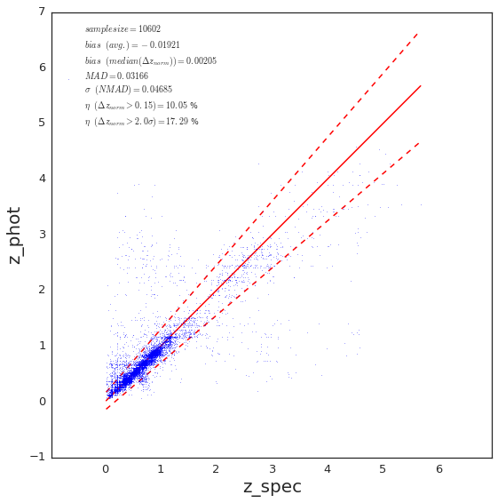

Entries selection based on clean cut
------------------------------------

We can check if after the clean cut we still have objects with 'wrong'
values, i.e. negative fluxes

We can use the :func:`PrimalCore.homogeneous_table.dataset_handler.keep_rows` and to apply a boolean array, or 
to set the :attr:`PrimalCore.homogeneous_table.MLDataSet.rows_maks'.
First we decide that we want to remove all the entries with a negative flux value
We use the :func:`PrimalCore.heterogeneous_table.tools.build_names_list`
to build a list with all the interested variable names

.. code:: python

    from PrimalCore.heterogeneous_table.tools import build_names_list
    
    flux_name_list=build_names_list('FLUX_*_2',dataset.features_names,regex=True)
    msk=np.ones(dataset.features_N_rows,dtype=np.bool)
    

Then we bild the boolean array according to 

.. code:: python

    msk=np.ones(dataset.features_N_rows,dtype=np.bool)
    
    for f in flux_name_list:
        msk*=dataset.get_feature_by_name(f)>0

finally we filter the rows, using two methods: \* dropping \* masking

since the dropping will modify the dataset features shape, we create a
copy

.. code:: python

    import copy
    original_dataset=copy.deepcopy(dataset)

dropping
~~~~~~~~

.. code:: python

    from PrimalCore.homogeneous_table.dataset_handler import keep_rows
    print 'rows befor cut',dataset.features_N_rows
    keep_rows(dataset,msk)
    print 'rows after cut',dataset.features_N_rows

.. parsed-literal::

    rows befor cut 13252
    rows after cut 12995

masking
~~~~~~~

.. code:: python

    original_dataset.rows_mask=msk
    print original_dataset.features_N_rows

.. parsed-literal::

    13252

.. code:: python

    print original_dataset.features.shape

.. parsed-literal::

    (12995, 24)

We retrain our molde, and plot the results for the new predictions

We apply the mask both to the train and test set

.. code:: python

    flux_name_list=build_names_list('FLUX_*_2',train.features_names,regex=True)
    
    msk=np.ones(train.features_N_rows,dtype=np.bool)
    
    for f in flux_name_list:
        msk*=train.get_feature_by_name(f)>0
    train.rows_mask=msk
        
    msk=np.ones(test.features_N_rows,dtype=np.bool)
    for f in flux_name_list:
        msk*=test.get_feature_by_name(f)>0
    test.rows_mask=msk

.. code:: python

    
    
    ada_boost_model.clf.fit(train.features,train.target_array)
    z_phot=ada_boost_model.clf.predict(test.features)
    z_spec=test.target_array
    
    prima_plot=plot_z_spec_vs_z_phot(z_spec,z_phot,plot=True)

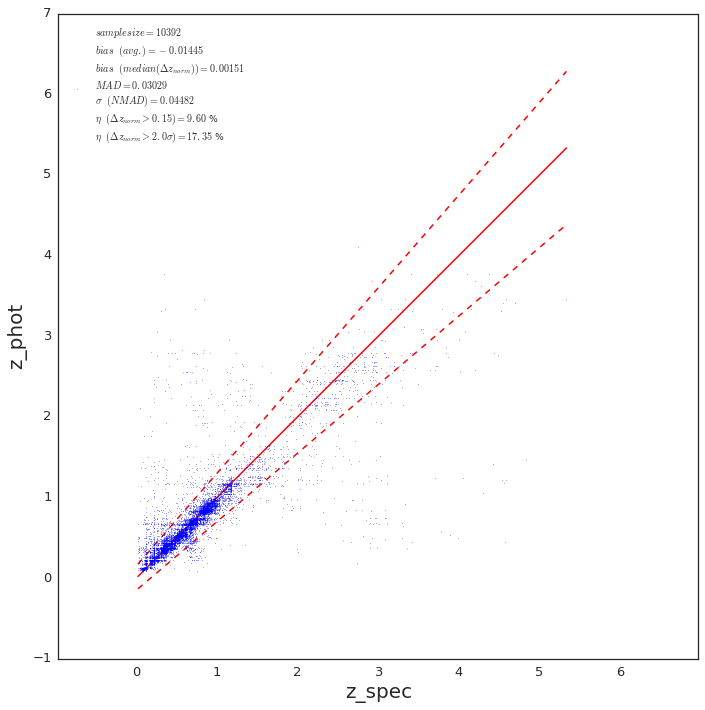

PDF
---

We can use the :func:`PrimalCore.pdf.tools.extract_pdf` to extract a matrix with rows storing z_pred per tree, and rows corresponding to each entry of the dataset. We estimate the pdf through a Gaussian Mixture model, testin for 2 components 

.. code:: python

    from PrimalCore.pdf.tools import extract_pdf
    pdf_matrix=extract_pdf(ada_boost_model, test,gmm_components=2)

.. code:: python

    from PrimalInteractive.plotting.phz_plots import plot_pdf
    
    n_cols=2
    n_rows=5
    plt.rcParams['figure.figsize']=10*n_cols,8*n_rows
    fig1,axs=plt.subplots(n_rows,n_cols)
    for ID,ax in enumerate(axs.flatten()):
        plot_pdf(pdf_matrix,ID,plot=True,ax=ax,bins=10)
    plt.tight_layout()

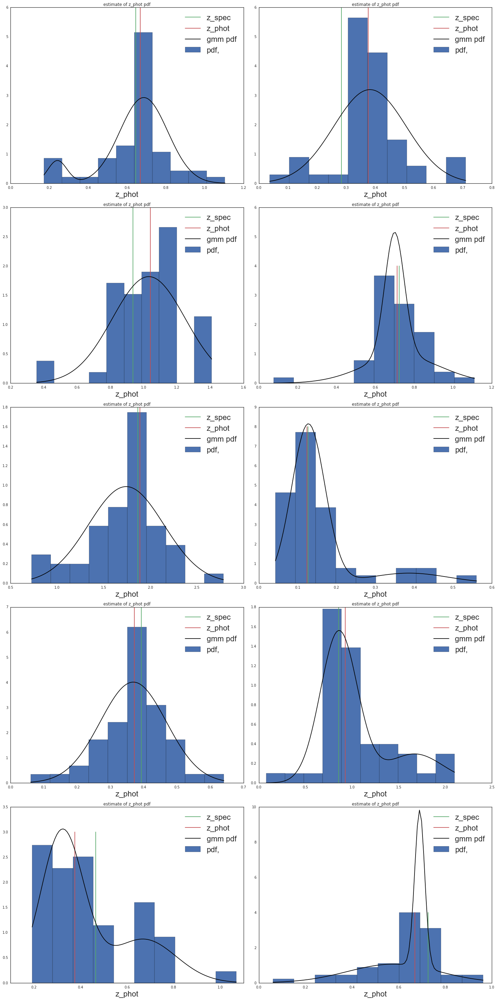

We can use the CRPS and the PIT index to evaluate the sample PDF bias.

.. code:: python

    from PrimalCore.pdf.stats import eval_pit,eval_crps
    from PrimalInteractive.plotting.phz_plots import plot_PIT_histogram,plot_pdf,plot_CRPS_histogram
    
    preds = ada_boost_model.eval_estimators_predictions(test.features)
    
    pit = eval_pit(pdf_matrix['z_phot_values'], pdf_matrix['z_spec'])
    cprs = eval_crps(pdf_matrix['z_phot_values'],pdf_matrix['z_spec'])

.. code:: python

    plt.rcParams['figure.figsize']=12,6
    
    fig1,(ax1,ax2)=plt.subplots(1,2)
    
    plot_PIT_histogram(pit, ax=ax1)
    plot_CRPS_histogram(cprs, ax=ax2)

.. parsed-literal::

    <PrimalInteractive.plotting.phz_plots.PrimalPlot at 0x135901e50>

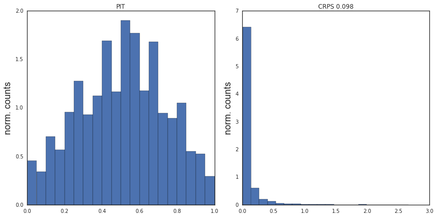

Saving predictions
------------------

.. code:: python

    
    data=ada_boost_model.save_mldataset_predictions('test_prediction.fits',test)

.. parsed-literal::

    /Users/orion/anaconda/lib/python2.7/site-packages/pyfits/file.py:339: UserWarning: Overwriting existing file 'test_prediction.fits'.
      warnings.warn("Overwriting existing file %r." % self.name)

Post trainig analysis
---------------------

In this section we show a possible post-training analysis, where we work
a the saved prediction file.

We load the prediction file for the test set

.. code:: python

    data,h=pf.getdata('test_prediction.fits',header=True)

We get the information for the original spectroscopic catalog

.. code:: python

    catalog_file=h.get('cat_file')

We load the catalog

.. code:: python

    
    from PrimalCore.heterogeneous_table.table import Table
    
    catalog=Table.from_fits_file(catalog_file,fits_ext=1)

.. parsed-literal::

    | input data built
    | data Rows,Cols 198435 124

Thank to the stored ``original_entry_ID`` field we can match any entry
in test set results file to the original spectroscopic dataset, and for
example check of the magnitude value (not used in the training) impacts
on the error on the predicted redshift

.. code:: python

    delta=np.fabs((data['actual']-data['pred']))/data['actual']
    from PrimalCore.heterogeneous_table.tools import build_names_list
    x_name_list=build_names_list('MAG_*',catalog.column_names,regex=True)

.. code:: python

    from PrimalInteractive.plotting.phz_plots import binned_trend_scatter_plot
    
    from matplotlib.pyplot import cm 
    %matplotlib inline
    n_cols=2
    n_rows=len(x_name_list)/2+1
    plt.rcParams['figure.figsize']=10*n_cols,5*n_rows
    color=iter(cm.rainbow(np.linspace(0,1,len(x_name_list))))
    fig,ax=plt.subplots(n_rows,n_cols)
    
    for a,x_name in zip(ax.flatten(),x_name_list):
        x=catalog.data[x_name][data['original_entry_ID']]
        
        msk=x>15
        #msk*=x<.2
       
        p=binned_trend_scatter_plot(x[msk],delta[msk],x_label='mag.',y_label='rel. err.',ax=a,color=next(color),label=x_name)
        a.set_xlim(15,35)
        a.set_yscale("log")
        a.set_ylim(0.001,100.)
    
    plt.tight_layout()
    plt.show()

.. parsed-literal::

    /Users/orion/anaconda/lib/python2.7/site-packages/numpy/core/_methods.py:59: RuntimeWarning: Mean of empty slice.
      warnings.warn("Mean of empty slice.", RuntimeWarning)
    /Users/orion/anaconda/lib/python2.7/site-packages/numpy/core/_methods.py:70: RuntimeWarning: invalid value encountered in double_scalars
      ret = ret.dtype.type(ret / rcount)
    /Users/orion/anaconda/lib/python2.7/site-packages/numpy/core/_methods.py:82: RuntimeWarning: Degrees of freedom <= 0 for slice
      warnings.warn("Degrees of freedom <= 0 for slice", RuntimeWarning)
    /Users/orion/anaconda/lib/python2.7/site-packages/numpy/core/_methods.py:94: RuntimeWarning: invalid value encountered in true_divide
      arrmean, rcount, out=arrmean, casting='unsafe', subok=False)
    /Users/orion/anaconda/lib/python2.7/site-packages/numpy/core/_methods.py:116: RuntimeWarning: invalid value encountered in double_scalars
      ret = ret.dtype.type(ret / rcount)
    /Users/orion/anaconda/lib/python2.7/site-packages/matplotlib/scale.py:101: RuntimeWarning: invalid value encountered in less_equal
      a[a <= 0.0] = 1e-300

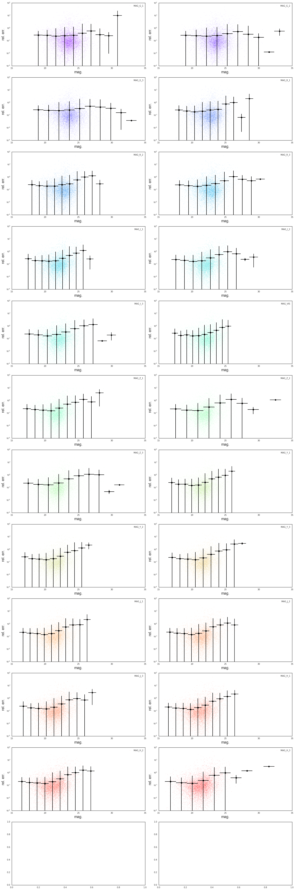

