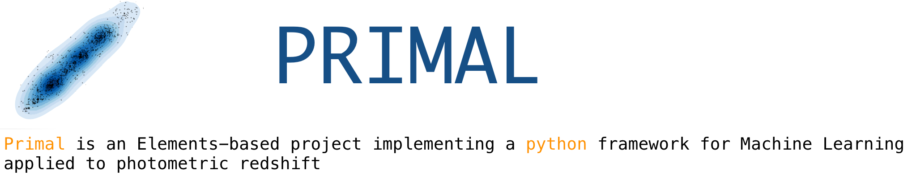

Author: [Andrea Tramacere](http://isdc.unige.ch/~tramacer) 

contact 
 - gmail: [mailto](andrea.tramacere@gmail.com)   
 - unige: [mailto](andrea.tramacere@unige.ch) 

## installation
If you use Anaconda:
     
     - $ while read requirement; do conda install --yes $requirement; done < requirements.txt
     - $ python setup.py install`

 If you use system python (*):
    
    - $ sudo python -m pip install --upgrade pip
    - $ pip install --user -r requirements.txt
    - $ python setup.py install --user (for local installation)

## documentation

[primal doc](http://isdc.unige.ch/~tramacer/primal_doc/html/index.html)

[tutorial](http://isdc.unige.ch/~tramacer/primal_doc/html/PrimalCore/quick_start/primal_core_tutorial.html)

[notebook](http://isdc.unige.ch/~tramacer/stuff/primal_core_tutorial.ipynb)